 Task:
 You are given a dataset of aerial images containing six classes: 'car', 'house', 'road', 'swimming 
pool', 'tree', and 'yard'. Your objectives are as follows:
# FAQ
- How to access the best.pt of YOLOv9?
>>  Unzip the [ZIP](./segment-20240710T143626Z-001.zip) which contains all the files from trained modules , predicted images from test,val and drone images

>> Inside train\weights you can find the `best.pt` and `last.pt` which are useful for the API and the prediction
- How to see the contents of YOLOv8?
>> Similar to YOLOv9 the contents can be found at [ZIP](./runs_yolov8.zip)

- Where is the solution to the written test?
>> [File](Solution_1,2,3.pdf)

- How to validate the API?
>> Simply run the folder inside [api](./api/predict.ipynb) ; treat it as a notebook and make sure the ngrok configuration is built upon and use the postman as instructed below

# Explanation
 1. Train a Model: Develop and train a machine learning model to detect and classify objects into 
the six specified classes
Creating a virtual environment
```python
py -3.11 -m venv yolo
yolo\Scripts\activate
python -m pip install --upgrade pip
pip install ultralytics
```
Importing Library

```python
import matplotlib.pyplot as plt
import os
from collections import Counter
import matplotlib.pyplot as plt
import matplotlib.patches as patches

from IPython.display import display

# display.clear_output()
from PIL import Image
import ultralytics
ultralytics.checks()
from ultralytics import YOLO
```

Configuring the data.yaml to use it for google drive as I need to use it for colab
```.yaml
train: /content/drive/MyDrive/datasets/datasets/train/images/
val: /content/drive/MyDrive/datasets/datasets/valid/images/
test: /content/drive/MyDrive/datasets/datasets/test/images/

nc: 6
names: ['car', 'house', 'road', 'swimming pool', 'tree', 'yard']
```
# File Structure
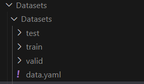

# Data Visualization & Preprocessing
``` python
def load_labels_from_directory(label_dir):
    labels = []
    for label_file in os.listdir(label_dir):
        if label_file.endswith('.txt'):
            with open(os.path.join(label_dir, label_file), 'r') as f:
                label = f.readline().strip()
                labels.append(label)
    return labels


def extract_labels(annotations):
    labels = []
    for annotation in annotations:
        label = annotation.split()[0]
        labels.append(label)
    return labels

def count_classes(labels):
    return Counter(labels)

train_label_dir = '/content/drive/MyDrive/datasets/datasets/train/labels'
valid_label_dir = '/content/drive/MyDrive/datasets/datasets/valid/labels'
test_label_dir = '/content/drive/MyDrive/datasets/datasets/test/labels'
train_labels = load_labels_from_directory(train_label_dir)
valid_labels = load_labels_from_directory(valid_label_dir)
test_labels = load_labels_from_directory(test_label_dir)
```

Distribution of class counts in train test and val:
Train: 
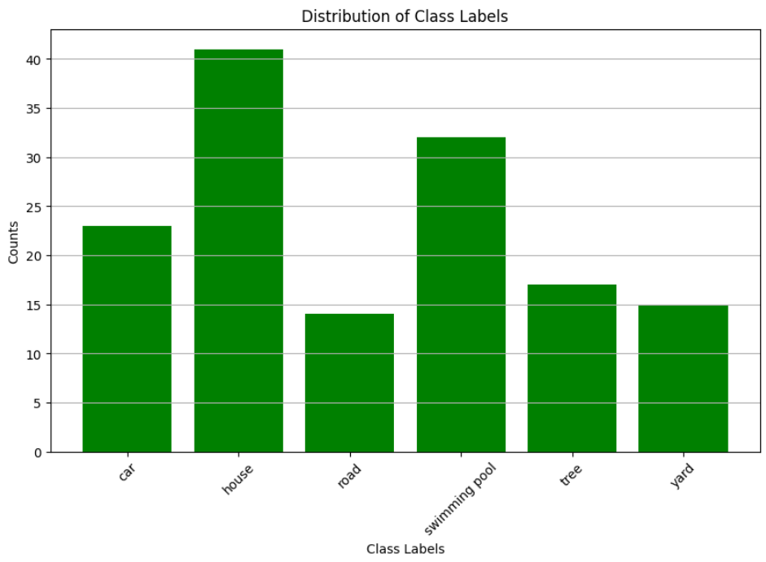
Val:
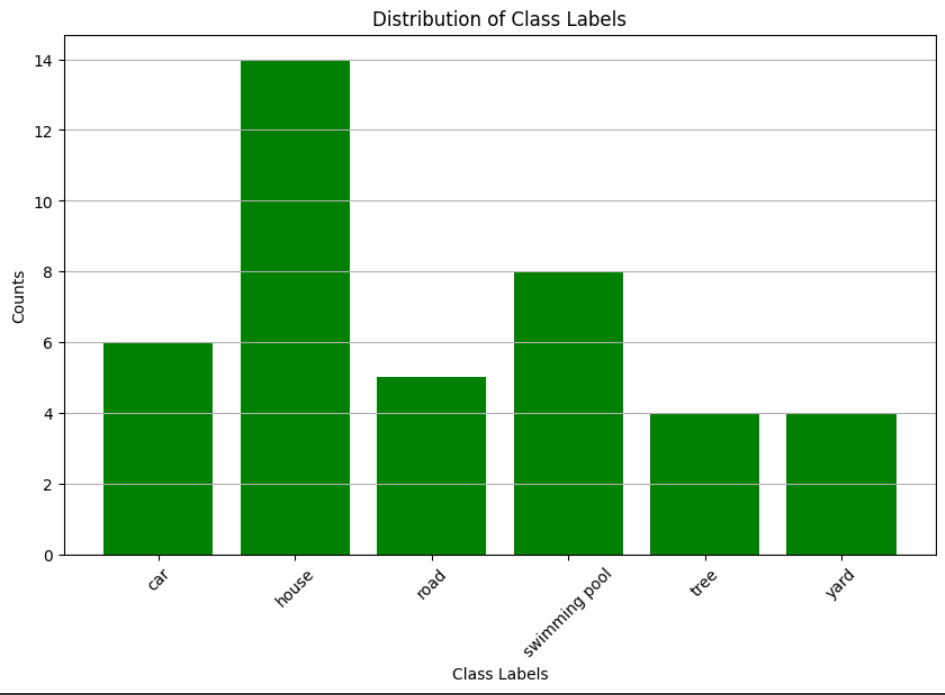
Test:
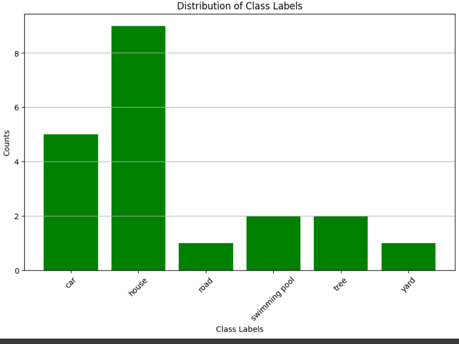
The image size provided is : `(640,640)` whereas of the high dimensional drone image is of `(6000,4000)`
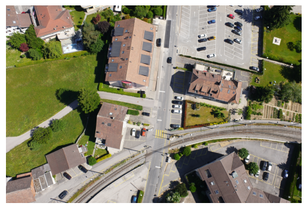
The images to be tested are of huge size and it is advised to ensure the consistency in the image size
```python


folder_path = "/content/drive/MyDrive/datasets/Drone Images Test"
output_folder = "/content/drive/MyDrive/resized_drone_test_images"
os.makedirs(output_folder, exist_ok=True)
for filename in os.listdir(folder_path):
    if filename.endswith(".JPG") :
        img = Image.open(os.path.join(folder_path, filename))
        print(filename)
        resized_img = img.resize((640,640))  
        resized_img.save(os.path.join(output_folder, filename))
        print(f"Resized and saved {filename}")

print("All images resized and saved successfully.")

```
The another approach could have been fragmenting the image into smaller fragments such that the desired height and width could have been acheived.
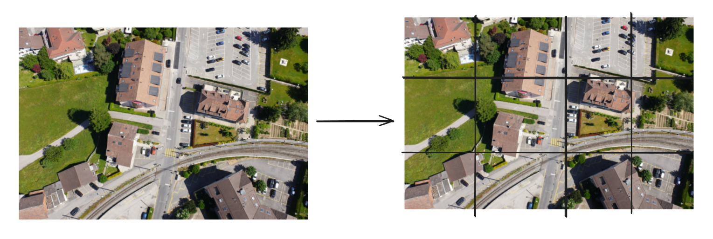

# Image with annotations
The annotation provided in the labels are 
`class x1 y1 x2 y2 x3 y3 ...`
```python
def load_image(image_path):
    return Image.open(image_path)


def parse_annotation(annotation):
    parts = annotation.strip().split()
    label = parts[0]
    coordinates = [float(x) for x in parts[1:]]
    return label, coordinates


def unnormalize_coordinates(coordinates, image_width, image_height):
    unnormalized_coordinates = []
    for i in range(0, len(coordinates), 2):
        x = coordinates[i] * image_width
        y = coordinates[i + 1] * image_height
        unnormalized_coordinates.extend([x, y])
    return unnormalized_coordinates


def plot_annotations(image_path, label_path):
      # Load image
    image = load_image(image_path)

    # Load annotations
    with open(label_path, 'r') as file:
        annotations = file.readlines()

    fig, ax = plt.subplots(1)
    ax.imshow(image)

    image_width, image_height = image.size
    print(f"Image size is {image.size}")
    for annotation in annotations:
        label, coordinates = parse_annotation(annotation)
        coordinates = unnormalize_coordinates(coordinates, image_width,
                                              image_height)
        polygon = [(coordinates[i], coordinates[i + 1])
                   for i in range(0, len(coordinates), 2)]
        polygon.append(polygon[0])  # Close the polygon

        poly = patches.Polygon(polygon,
                               closed=True,
                               fill=False,
                               edgecolor='red',
                               linewidth=2)
        ax.add_patch(poly)
        ax.text(polygon[0][0],
                polygon[0][1],
                label,
                color='yellow',
                fontsize=12,
                weight='bold')

    plt.show()
```
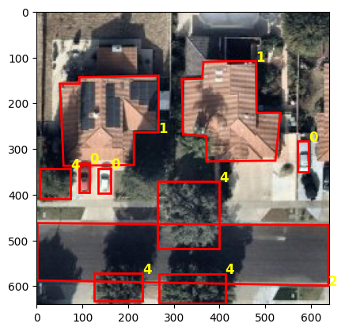
# YOLO algorithm
yolov9 was proposed in the paper [YOLOv9: Learning What You Want to Learn
 Using Programmable Gradient Information](https://arxiv.org/pdf/2402.13616)
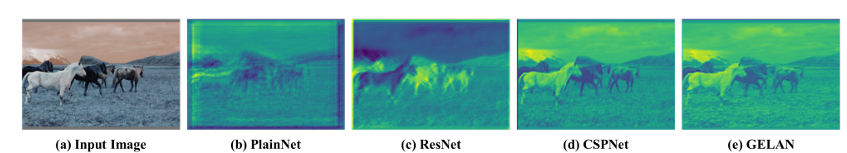
This is the most recent deep learning techniques concentrate on creating objective functions that are optimally suited to produce model predictions that are as near to the actual data as possible. In the interim, it is necessary to create a suitable architecture that can make it easier to gather sufficient data for prediction. Current approaches overlook the fact that a significant amount of information is lost during layer-by-layer feature extraction and spatial translation of incoming data. Information bottlenecks and reversible functions—two significant causes of data loss during data transmission across deep networks—will be covered in detail in this presentation. To address the several modifications that deep networks need to make in order to accomplish several goals, we introduced the idea of programmable gradient information (PGI). On working out the YOLOv9 was found to be one of the best algorithms for the development test. The architecture it uses is :
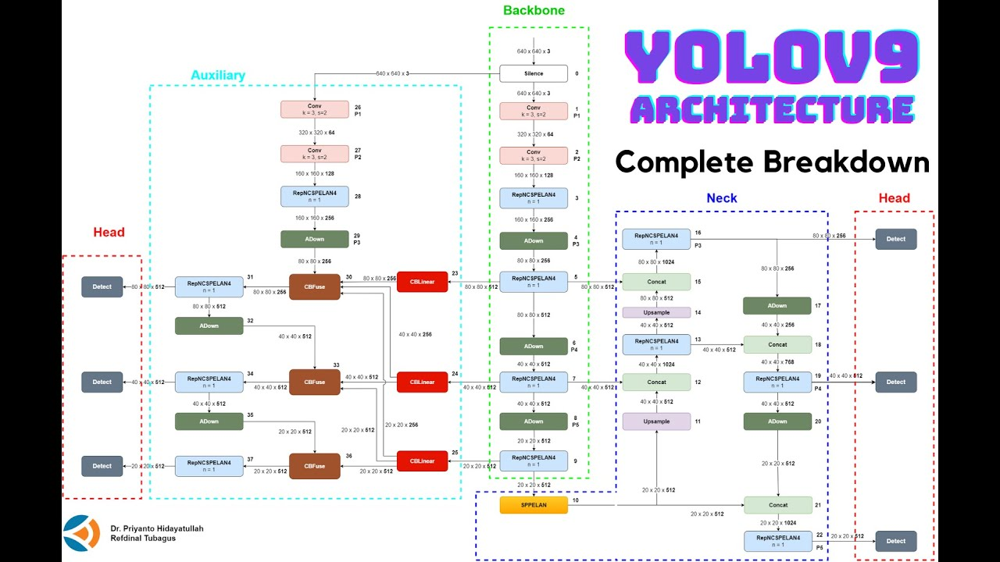
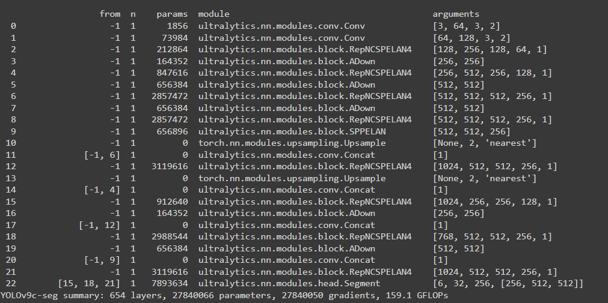
Data augmentation supported:
`Blur(p=0.01, blur_limit=(3, 7)), MedianBlur(p=0.01, blur_limit=(3, 7)), ToGray(p=0.01), CLAHE(p=0.01, clip_limit=(1, 4.0), tile_grid_size=(8, 8))`

Training
```
HOME = '/content/drive/MyDrive/yolov9c-seg'
%cd {HOME}
!yolo task=segment mode=train model=yolov9c-seg.pt data='{DATA_DIR}/data.yaml' epochs=50 imgsz=640
```
**Summary**
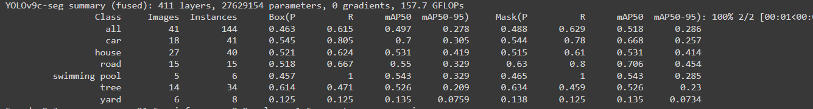
*Confusion Matrix*
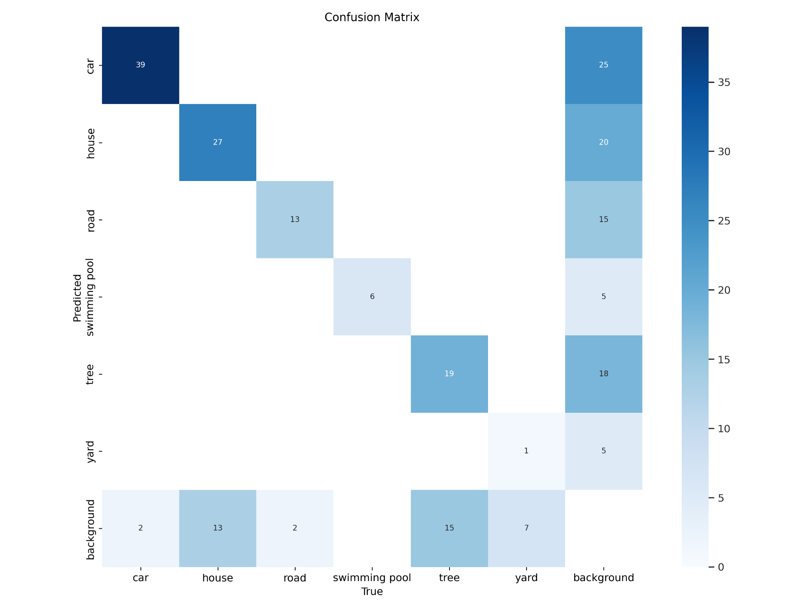
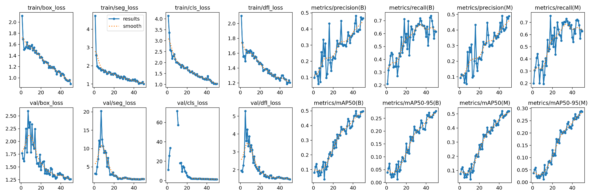
The chart suggests that loss is decreasing on each epoch and due to time and resource constraints I was limited to 50 epochs but could have increased to 100-200 epochs. 
-The confusion matrix shows that cars are shown to be quite mistaken as the background and the yard is greatly mistaken as the background by the model
*In validation set,*
```
%cd {HOME}
!yolo task=segment mode=val model='{HOME}/runs/segment/train/weights/best.pt' data='{DATA_DIR}/data.yaml'
```
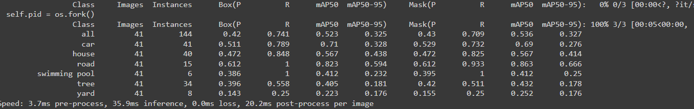
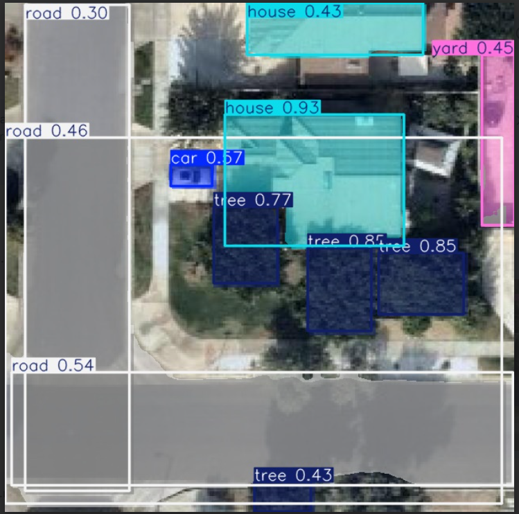
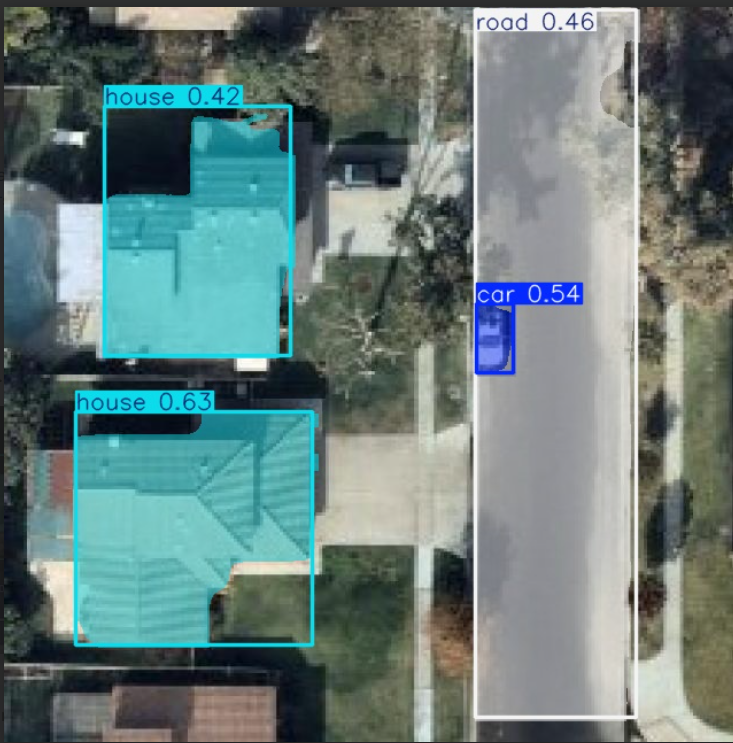
*Similarly for the test set*
```
%cd {HOME}
!yolo task=segment mode=predict model='{HOME}/runs/segment/train/weights/best.pt' conf=0.25 source='/content/drive/MyDrive/datasets/datasets/test/images' save=true name='test_predictions'
```
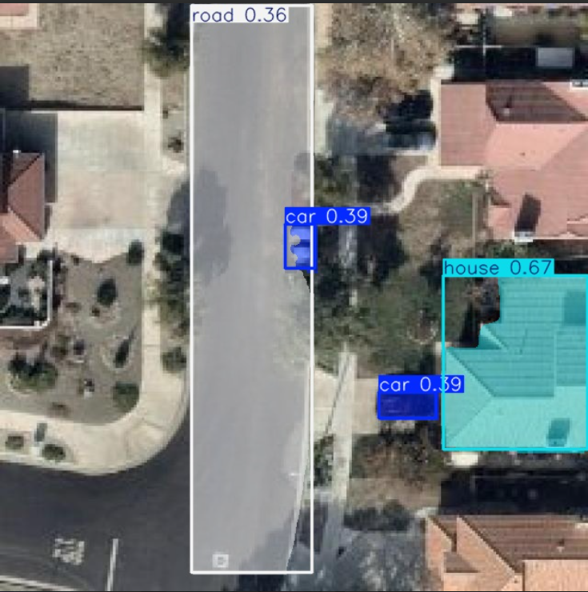
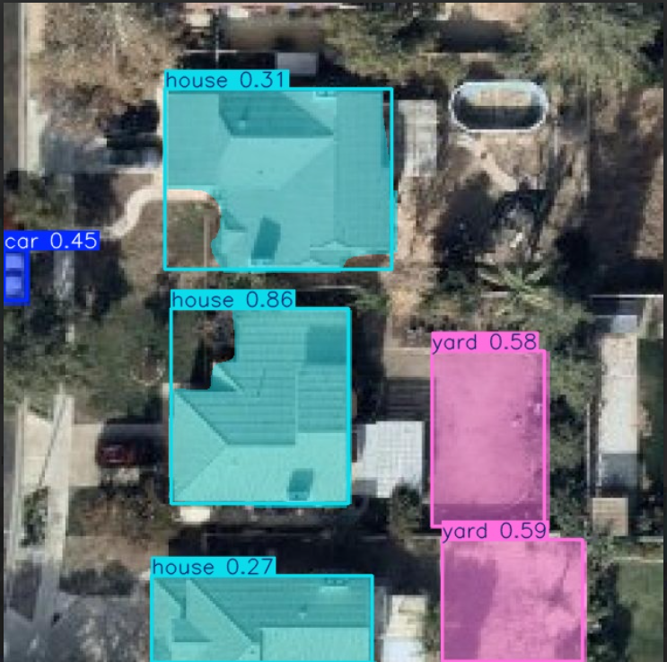
*High Quality Drone Images*
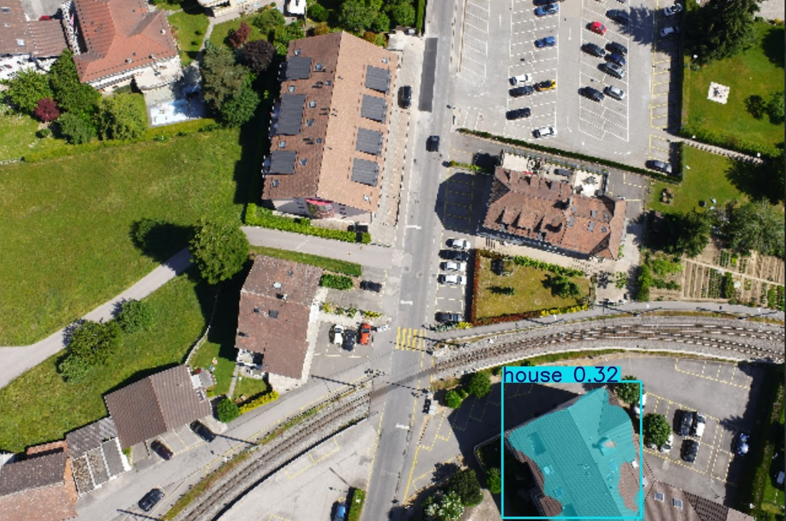
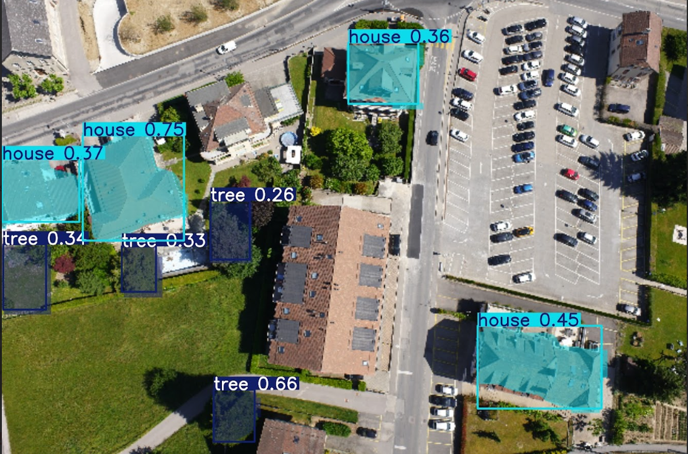
*Resized High Quality Drone Images*
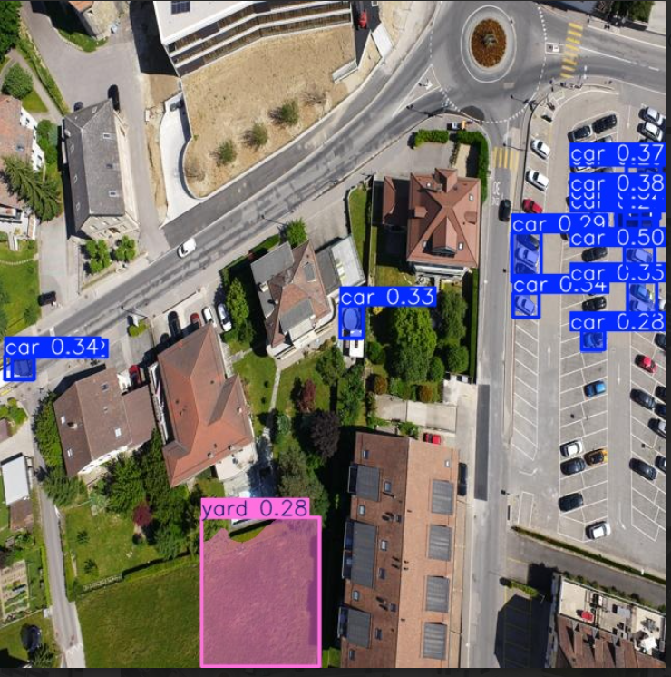
```
%cd {HOME}
!yolo task=segment mode=predict model='{HOME}/runs/segment/train/weights/best.pt' conf=0.25 source='/content/drive/MyDrive/resized_drone_test_images' save=true name='drone_images_predictions'
```
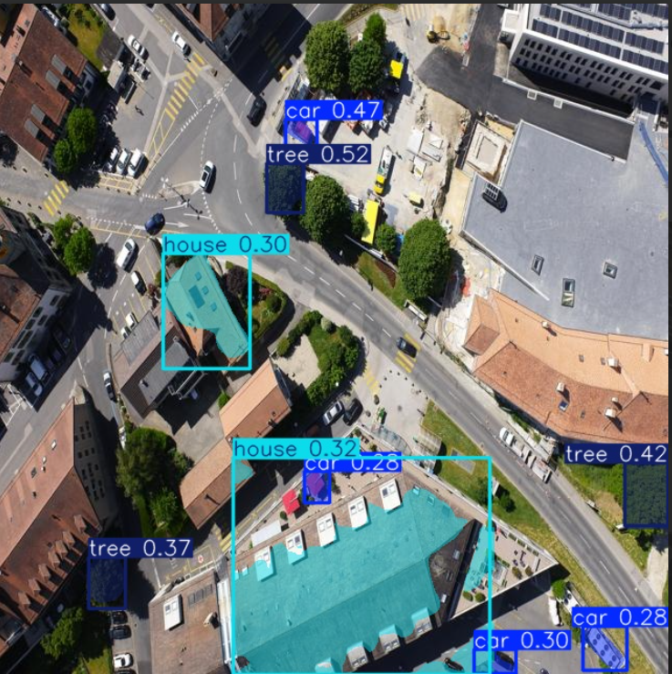
However on trying to work with `yolov9e-seg.pt` memory error was detected
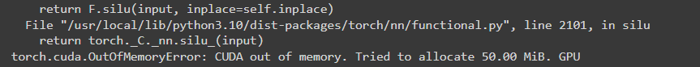

2. Create an API Develop an API that can accept an image, detect and classify objects, and return 
the predictions along with bounding box coordinates for each detected object. This image is a 
high-quality drone image with geolocation data EXIF, XMP


```
import io
from PIL import Image
from flask import Flask, request
import nest_asyncio
from pyngrok import ngrok
import torch
from ultralytics import YOLO

app = Flask(__name__)
model = YOLO('best.pt')


@app.route("/objectdetection/", methods=["POST"])
def predict():
    if not request.method == "POST":
        return

    if request.files.get("image"):
        image_file = request.files["image"]
        image_bytes = image_file.read()
        img = Image.open(io.BytesIO(image_bytes))
        img = img.reshape(640,640)
        results = model(img)
        class_indices = results[0].boxes.cls
        indices = class_indices.to(dtype=torch.int).tolist()
        names = ['car', 'house', 'road', 'swimming pool', 'tree', 'yard']
        mapped_names = [names[idx] for idx in indices]
        results_json = {
            "boxes": results[0].boxes.xyxy.tolist(),
            "classes": mapped_names,
            "confidence":results[0].boxes.conf.tolist()
        }
        return {"result": results_json}


ngrok_tunnel = ngrok.connect(5000)
print('Public URL:', ngrok_tunnel.public_url)
nest_asyncio.apply()
app.run(host="0.0.0.0", port=5000)
```
I hope the ngrok is configured in this term
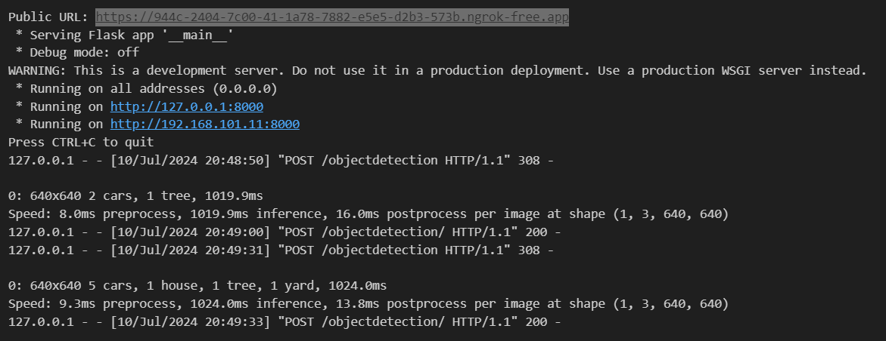
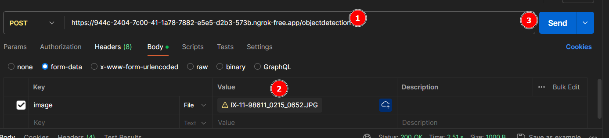
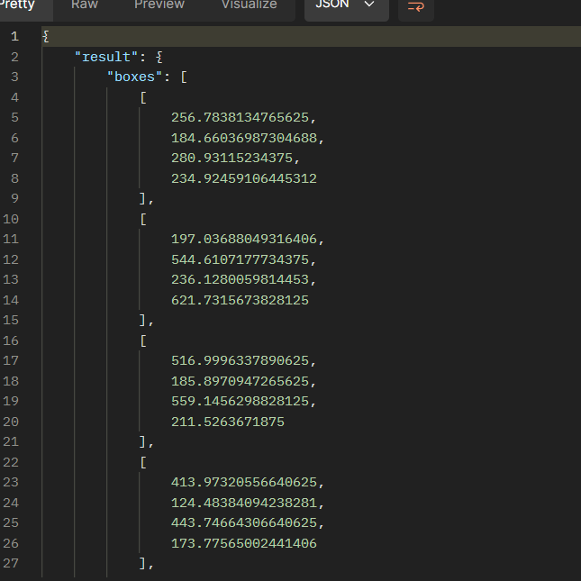
```json
{
    "result": {
        "boxes": [
            [
                256.7838134765625,
                184.66036987304688,
                280.93115234375,
                234.92459106445312
            ],
            [
                197.03688049316406,
                544.6107177734375,
                236.1280059814453,
                621.7315673828125
            ],
            [
                516.9996337890625,
                185.8970947265625,
                559.1456298828125,
                211.5263671875
            ],
            [
                413.97320556640625,
                124.48384094238281,
                443.74664306640625,
                173.77565002441406
            ],
            [
                76.98167419433594,
                188.19851684570312,
                169.49618530273438,
                342.4807434082031
            ],
            [
                1.717864990234375,
                390.8797302246094,
                216.53475952148438,
                638.1531982421875
            ],
            [
                515.683837890625,
                178.48582458496094,
                553.950927734375,
                211.6399688720703
            ],
            [
                417.0240478515625,
                181.49562072753906,
                437.6375732421875,
                203.02882385253906
            ]
        ],
        "classes": [
            "car",
            "tree",
            "car",
            "car",
            "house",
            "yard",
            "car",
            "car"
        ],
        "confidence": [
            0.4641158878803253,
            0.4473479688167572,
            0.3838241696357727,
            0.3237011134624481,
            0.3161289095878601,
            0.31437838077545166,
            0.286126971244812,
            0.25324496626853943
        ]
    }
}
```
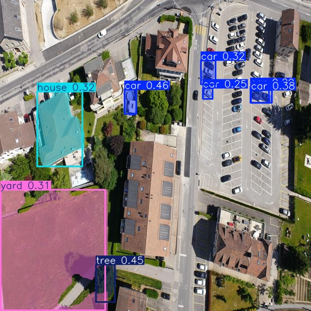

Further the API can be used to host it using AWS Sagemaker to deploy on the cloud
# Comparision with other models
**yolov8m-seg**
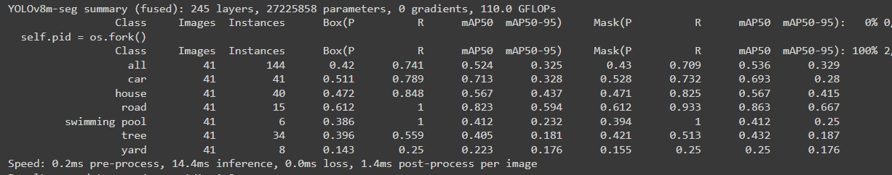
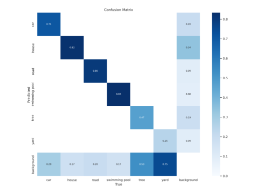
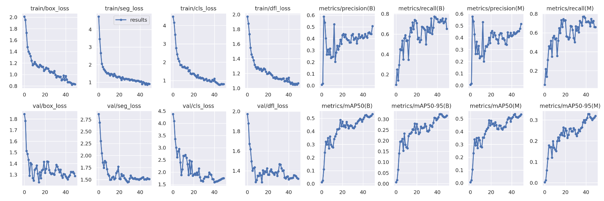
In comparision, yolov9 is far better than yolov8

# Conclusion
The problem I see with this test set is the lack of data.Open-source training datasets such as COCO (Common Objects in Context) dataset and pre-trained models are predominantly available for non-ortho images [Ref](https://www.esri.com/arcgis-blog/products/arcgis-pro/geoai/enhanced-object-detection-using-drones-and-ai/#:~:text=One%20of%20the%20tasks%20that,objects%20within%20images%20and%20videos.) .YOLO is not properly built for the drone image. The limited details add the burden to the model. The domain shift is another problem with the dataset as well. The high pixels drone images mostly have the cars and houses.This difference has somewhat affected the performance of machine learning models trained on the training set and then tested on the test set, because the model may not generalize well to the test data due to the domain shift.